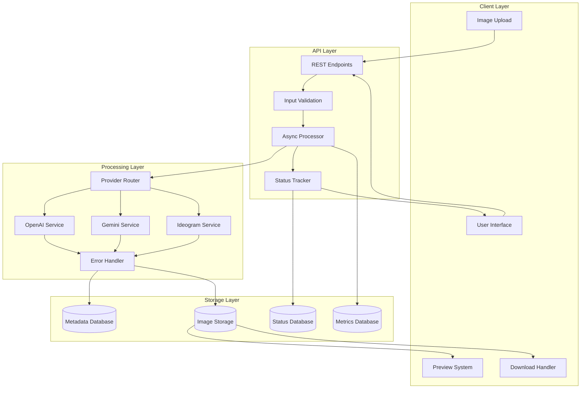
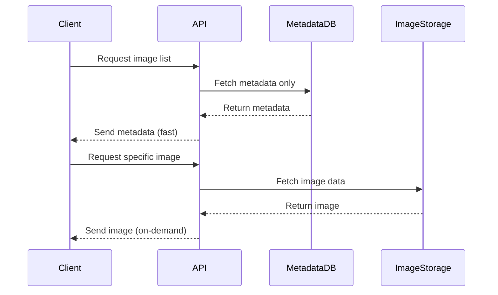
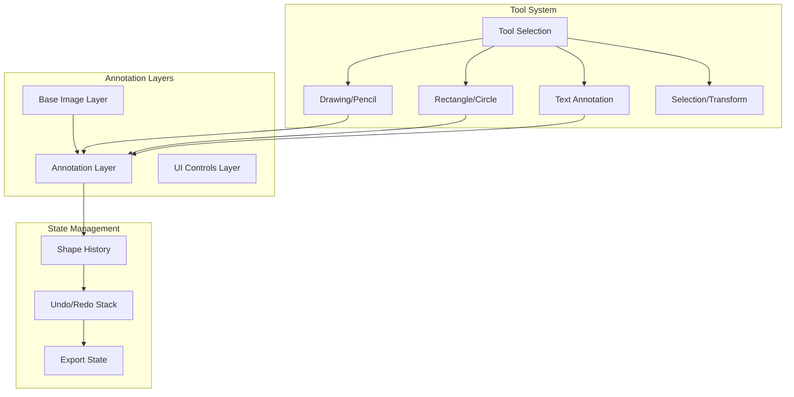
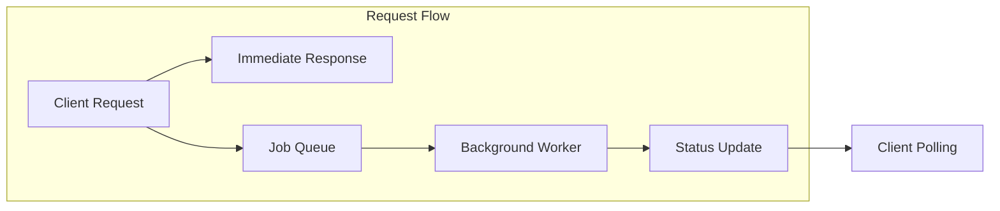
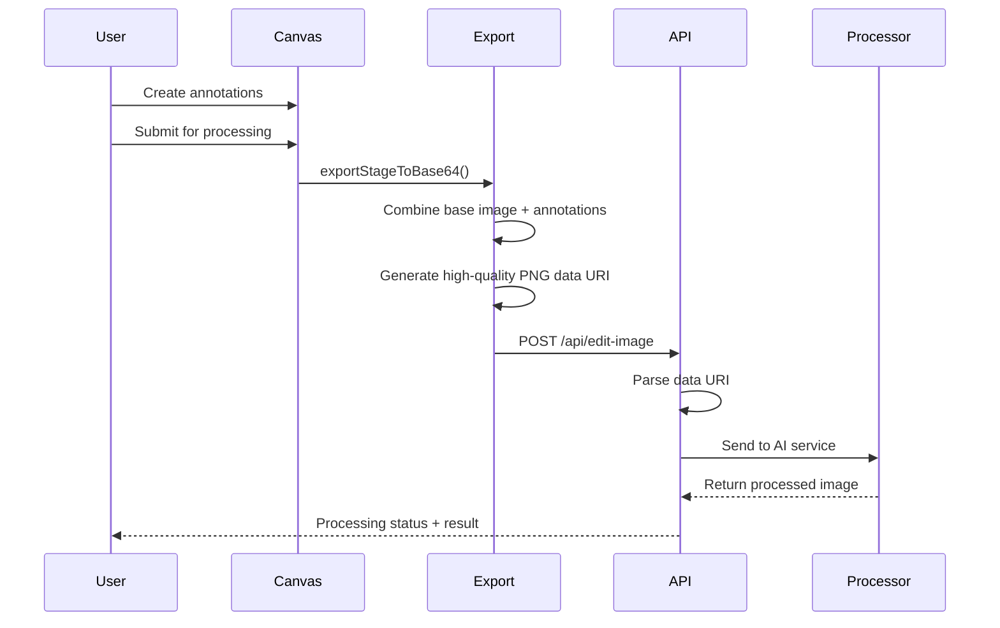
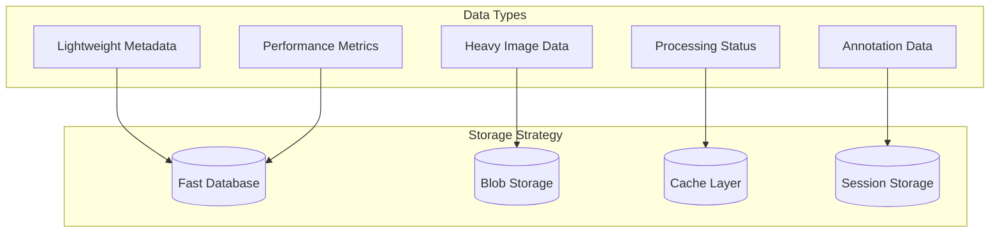

# Image Processing & Management Pattern

## Overview

This document describes comprehensive image processing patterns for production-ready applications, covering asynchronous processing, multi-provider API integration, optimized storage strategies, and progressive loading techniques. These patterns enable scalable image generation, editing, and management in modern web applications.

## Architecture

### Core Processing Flow

The image processing architecture follows a sophisticated async-first approach with clear separation of concerns:

## Key Patterns

### 1. Asynchronous Processing Pattern

**Fire-and-Forget Architecture**
- Immediate response to client with processing identifier
- Background job execution without blocking user interface
- Real-time status updates through polling or websockets
- Graceful handling of long-running operations

**Status Management**
- Clear state progression: `pending` → `processing` → `completed`/`failed`
- Atomic status updates with timestamp tracking
- Error state preservation with detailed failure reasons
- Retry mechanism for transient failures

**Benefits:**
- Improved user experience with immediate feedback
- Better resource utilization through background processing
- Scalable architecture supporting high concurrency
- Resilient to temporary service outages

### 2. Metadata-First Loading Pattern

**Progressive Data Loading**
- Load lightweight metadata immediately for UI rendering
- Defer heavy image data until specifically requested
- Separate API endpoints for metadata vs image content
- Intelligent caching strategies based on data type

**Implementation Strategy:**

**Performance Benefits:**
- Dramatically reduced initial load times
- Lower bandwidth usage for browsing
- Better perceived performance
- Efficient memory utilization

### 3. Multi-Provider Integration Pattern

**Provider Abstraction Layer**
- Unified interface across different AI service providers
- Runtime provider selection based on user preference or availability
- Consistent error handling and response formatting
- Automatic fallback mechanisms

**Configuration Management**
- Database-first API key storage with environment fallback
- Dynamic provider switching without code changes
- Provider-specific optimization settings
- Cost and performance tracking per provider

**Error Handling Strategy:**
- Provider-specific error message translation
- Intelligent retry logic with exponential backoff
- Graceful degradation when providers are unavailable
- Detailed logging for debugging and monitoring

### 4. Parallel Processing Pattern

**Concurrent Generation**
- Multiple image variants generated simultaneously
- Temperature or style variations for diversity
- Promise-based coordination with partial failure handling
- Result aggregation with success/failure tracking

**Optimization Techniques:**
- Batch processing for related operations
- Resource pooling to prevent overwhelming providers
- Intelligent queuing with priority management
- Load balancing across multiple provider instances

### 5. Storage Optimization Pattern

**Database Design Principles**
- Separate tables for metadata and binary data
- Efficient indexing for common query patterns
- Proper data types for different content (base64, URLs, metadata)
- Performance metrics storage for analysis

**Content Management:**
- Base64 encoding for smaller images (< 1MB)
- External storage URLs for larger content
- Automatic cleanup of expired or failed processing attempts
- Compression strategies based on image type and usage

### 6. Interactive Image Annotation Pattern

**Canvas-Based Annotation System**
- Layer-based architecture separating base image from annotations
- Multiple annotation tools (drawing, shapes, text, selection)
- Real-time visual feedback during annotation creation
- Non-destructive editing preserving original image integrity

**Annotation State Management:**

**Canvas Export and Integration:**
- High-quality canvas export (2x pixel ratio for crisp results)
- Composite rendering combining base image with annotations
- Data URI generation for seamless API integration
- Annotation state tracking for UI responsiveness

### 7. Progressive User Interface Pattern

**Loading States Management**
- Skeleton screens during metadata loading
- Progressive image revelation as data becomes available
- Smooth transitions between loading and loaded states
- Error state visualization with retry options

**Navigation and Preview:**
- Thumbnail grids with lazy loading
- Full-screen modal previews with keyboard navigation
- Batch operations with progress indicators
- Download handling with proper MIME type detection

## Implementation Strategies

### 1. Async Processing Implementation

**Job Queue Architecture**

**Key Components:**
- **Request Handler**: Validates input and creates job record
- **Job Queue**: Manages processing tasks with priority and retry logic
- **Background Worker**: Executes actual image processing
- **Status Service**: Provides real-time updates to clients
- **Cleanup Service**: Removes expired jobs and temporary data

### 2. Provider Integration Strategy

**Service Layer Design**
- Abstract base class defining common interface
- Provider-specific implementations handling API differences
- Configuration management for API keys and settings
- Error translation layer for consistent user experience

**Dynamic Provider Selection**
- User preference storage and retrieval
- Provider availability checking
- Automatic fallback chains
- Performance-based routing decisions

### 3. Annotation-to-API Integration Strategy

**Canvas Export Workflow**

**Data Format Standardization:**
- **Input Format**: PNG data URI with 2x pixel ratio for quality
- **Composite Rendering**: Base image + annotation layers flattened
- **API Payload**: JSON with imageData, prompt, and processing parameters
- **Annotation Preservation**: Non-destructive editing maintaining original

### 4. Data Flow Architecture

**Separation of Concerns**

**Caching Strategy:**
- Metadata: Short-term cache (5-15 minutes)
- Images: Long-term cache (hours to days)
- Annotations: Session-based (temporary, non-persistent)
- Status: Real-time cache with TTL
- User preferences: Session-based cache

### 5. Interactive Annotation Implementation

**Canvas Technology Stack**
- **Rendering Engine**: HTML5 Canvas with library abstraction (Konva.js pattern)
- **Layer Management**: Separate layers for base image, annotations, and UI controls
- **Tool System**: Modular tool architecture (select, draw, shapes, text)
- **State Management**: History stack for undo/redo functionality

**Annotation Tools Architecture:**
- **Drawing Tool**: Freehand drawing with pressure sensitivity support
- **Shape Tools**: Geometric primitives (rectangles, circles, lines)
- **Text Tool**: Positioned text with font customization
- **Selection Tool**: Transform controls for editing existing annotations

**Export and Processing Integration:**
- **High-Quality Export**: 2x pixel ratio rendering for crisp results
- **Composite Rendering**: Flatten all layers into single image
- **Data URI Generation**: Immediate conversion for API consumption
- **Annotation State Tracking**: UI responsiveness during processing

### 6. Error Handling Framework

**Layered Error Management**
- **Input Validation**: Client-side and server-side validation
- **Canvas Export Errors**: Handle canvas rendering and export failures
- **Provider Errors**: Service-specific error handling and translation
- **System Errors**: Infrastructure and database error management
- **User Communication**: Clear, actionable error messages

**Annotation-Specific Error Handling:**
- **Canvas Export Failures**: Graceful fallback to original image
- **Invalid Annotation Data**: Validation before processing
- **Memory Limitations**: Large canvas handling and optimization
- **Touch/Mouse Event Conflicts**: Cross-platform input handling

**Retry Strategies:**
- Exponential backoff for temporary failures
- Circuit breaker pattern for provider outages
- Dead letter queues for persistent failures
- Manual retry options for user-initiated operations

## Performance Optimization

### 1. Loading Optimization

**Metadata-First Approach**
- Load essential information immediately
- Defer non-critical data until needed
- Implement intelligent prefetching based on user behavior
- Use progressive enhancement for feature availability

**Image Optimization**
- Automatic format selection (WebP, JPEG, PNG)
- Resolution-based serving for different screen sizes
- Lazy loading with intersection observers
- Compression optimization based on content type

### 2. Caching Strategies

**Multi-Level Caching**
- Browser cache for static assets
- CDN cache for frequently accessed images
- Application cache for computed results
- Database query cache for metadata

**Cache Invalidation**
- Time-based expiration for generated content
- Event-based invalidation for user changes
- Selective invalidation for related data
- Graceful fallback when cache misses occur

### 3. Resource Management

**Connection Pooling**
- Reuse HTTP connections to external APIs
- Manage connection limits to prevent overwhelming services
- Implement timeout and retry logic
- Monitor connection health and performance

**Memory Management**
- Stream processing for large images
- Garbage collection optimization
- Memory leak prevention in long-running processes
- Resource cleanup after processing completion

## Security Considerations

### 1. Input Validation

**File Security**
- MIME type validation and verification
- File size limits and enforcement
- Content scanning for malicious payloads
- Sanitization of user-provided metadata

**API Security**
- Rate limiting per user and IP address
- Authentication and authorization checks
- Input sanitization for all parameters
- Protection against injection attacks

### 2. Data Protection

**Storage Security**
- Encryption at rest for sensitive images
- Secure transmission protocols (HTTPS)
- Access logging and audit trails
- Regular security assessments

**Privacy Compliance**
- User consent management for image processing
- Data retention policies and enforcement
- Right to deletion implementation
- Cross-border data transfer compliance

## Monitoring and Analytics

### 1. Performance Metrics

**Processing Metrics**
- Average processing time per provider
- Success/failure rates by operation type
- Queue depth and processing latency
- Resource utilization patterns

**User Experience Metrics**
- Time to first meaningful content
- Image loading completion rates
- User interaction patterns
- Error recovery success rates

### 2. Business Intelligence

**Usage Analytics**
- Popular image processing operations
- Provider performance comparisons
- Cost analysis per operation type
- User engagement with generated content

**Quality Metrics**
- User satisfaction ratings
- Retry rates for failed operations
- Support ticket correlation with processing issues
- A/B testing results for UI improvements

## Scalability Patterns

### 1. Horizontal Scaling

**Service Distribution**
- Microservice architecture for independent scaling
- Load balancing across processing workers
- Database sharding for high-volume operations
- CDN distribution for global performance

**Auto-Scaling Strategies**
- Queue-based scaling triggers
- CPU and memory utilization monitoring
- Predictive scaling based on usage patterns
- Cost-optimized scaling policies

### 2. Vertical Optimization

**Resource Optimization**
- Memory-efficient image processing algorithms
- CPU optimization for intensive operations
- I/O optimization for database and storage access
- Network optimization for external API calls

**Capacity Planning**
- Growth projection based on usage trends
- Peak load handling strategies
- Disaster recovery and failover planning
- Performance testing and benchmarking

## Testing Strategies

### 1. Functional Testing

**API Testing**
- Comprehensive endpoint testing with various inputs
- Error condition simulation and validation
- Integration testing with external providers
- End-to-end workflow validation

**UI Testing**
- Progressive loading behavior verification
- Error state handling validation
- Cross-browser compatibility testing
- Mobile responsiveness testing

### 2. Performance Testing

**Load Testing**
- Concurrent user simulation
- Peak load capacity determination
- Database performance under stress
- External API rate limit testing

**Stress Testing**
- System behavior beyond normal capacity
- Recovery testing after overload conditions
- Memory leak detection in long-running tests
- Failover mechanism validation

## Common Pitfalls and Solutions

### 1. Performance Issues

**Problem: Slow Initial Loading**
- Solution: Implement metadata-first loading pattern
- Solution: Use progressive image loading techniques
- Solution: Optimize database queries with proper indexing
- Solution: Implement effective caching strategies

**Problem: Provider API Limits**
- Solution: Implement intelligent rate limiting and queuing
- Solution: Use multiple providers with load balancing
- Solution: Cache results to reduce API calls
- Solution: Implement exponential backoff for retries

### 2. User Experience Problems

**Problem: Unclear Processing Status**
- Solution: Provide clear, real-time status updates
- Solution: Implement estimated completion times
- Solution: Show progress indicators where possible
- Solution: Offer cancel options for long operations

**Problem: Error Recovery**
- Solution: Provide clear error messages with next steps
- Solution: Implement automatic retry for transient errors
- Solution: Offer manual retry options for user control
- Solution: Maintain operation history for troubleshooting

### 3. Technical Challenges

**Problem: Canvas Performance with Complex Annotations**
- Solution: Implement layer-based rendering optimization
- Solution: Use object pooling for frequently created/destroyed shapes
- Solution: Implement viewport-based culling for large canvases
- Solution: Debounce expensive operations like export

**Problem: Cross-Platform Touch/Mouse Handling**
- Solution: Unified event handling abstraction
- Solution: Touch gesture recognition for mobile devices
- Solution: Pressure sensitivity support where available
- Solution: Responsive tool sizing for different screen densities

**Problem: Memory Leaks in Processing**
- Solution: Implement proper resource cleanup
- Solution: Use streaming for large image processing
- Solution: Monitor memory usage and set limits
- Solution: Regular garbage collection optimization

**Problem: Canvas Export Quality Issues**
- Solution: Use high pixel ratio (2x) for export rendering
- Solution: Implement proper color space management
- Solution: Optimize compression settings for different use cases
- Solution: Validate export results before API submission

**Problem: Inconsistent Provider Results**
- Solution: Implement result normalization layers
- Solution: Provide consistent error handling across providers
- Solution: Use standardized response formats
- Solution: Implement quality validation for results

## Best Practices Summary

### 1. Architecture Principles

- **Async-First Design**: Always prefer non-blocking operations
- **Separation of Concerns**: Keep metadata, images, and status separate
- **Provider Abstraction**: Never tie directly to specific service APIs
- **Progressive Enhancement**: Build features that degrade gracefully

### 2. Implementation Guidelines

- **Error Handling**: Plan for failures at every level
- **Canvas Management**: Implement proper layer separation and state management
- **Export Quality**: Use high pixel ratios and proper compression
- **Cross-Platform**: Design for both desktop and mobile interaction patterns
- **Monitoring**: Instrument everything for observability
- **Testing**: Test both success and failure scenarios
- **Security**: Validate and sanitize all inputs including canvas data

### 3. User Experience Focus

- **Immediate Feedback**: Always provide instant acknowledgment
- **Clear Communication**: Explain what's happening and why
- **Recovery Options**: Offer ways to fix problems
- **Performance**: Optimize for perceived speed over absolute speed

This pattern provides a comprehensive foundation for building robust, scalable image processing systems that deliver excellent user experiences while maintaining high performance and reliability.
